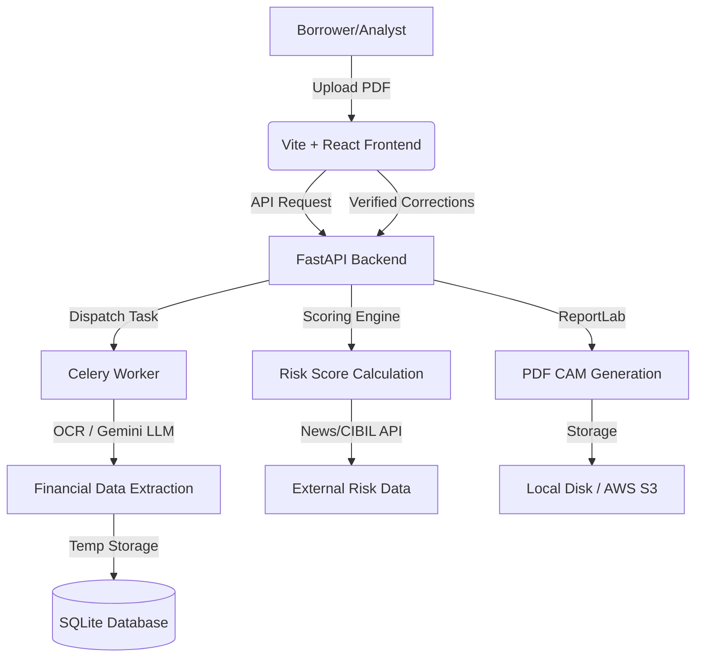

# Intelli-Credit AI 🚀

Intelli-Credit AI is a state-of-the-art automated credit appraisal platform designed for modern financial institutions. It leverages AI-powered document extraction (OCR + LLM), weighted risk scoring models, and real-time external intelligence to streamline the commercial lending process.

---

## 🌟 Key Features

- **AI-Powered Extraction**: Automatically extract financial data from balance sheets and P&L statements using Google Gemini and OCR.
- **Async Processing**: High-performance document processing pipeline powered by Celery and Redis.
- **Risk Scoring Engine**: Sophisticated rule-based and weighted scoring models including internal financial ratios and external risk factors.
- **External Intelligence**: Integrated News Agent and CIBIL-style risk checks for comprehensive borrower analysis.
- **Interactive Review**: A sleek, Figma-inspired dashboard for analysts to verify, correct, and finalize evaluations.
- **Automated CAM Generation**: Instant generation of professional Credit Appraisal Memos (CAMs) in PDF format.
- **Full History & Analytics**: Track historical performance and portfolio risk distribution with interactive charts.

---

## 🏗️ Architecture



---

## 🛠️ Tech Stack

### Backend
- **Framework**: [FastAPI](https://fastapi.tiangolo.com/) (Python)
- **Database**: SQLAlchemy ORM with SQLite (Postgres-ready)
- **Async Tasks**: Celery with Redis broker
- **AI/ML**: Google Generative AI (Gemini), PyMuPDF, Pytesseract
- **Reporting**: ReportLab (PDF Generation)
- **Security**: JWT Authentication & RBAC

### Frontend
- **Bundle/Build**: [Vite](https://vitejs.dev/) + TypeScript
- **Framework**: React 18
- **Styling**: Tailwind CSS + ShadcnUI + Radix UI
- **Visualization**: Recharts + Lucide Icons
- **State/Forms**: React Hook Form + Sonner Toasts

---

## 🚀 Getting Started

### Prerequisites
- Python 3.10+
- Node.js 18+
- Redis (for async processing)
- Tesseract OCR engine (for document ingestion)

### Backend Setup
1. **Initialize Environment**:
   ```bash
   python -m venv venv
   source venv/bin/activate  # Mac/Linux
   pip install -r requirements.txt
   ```
2. **Configure Environment Variables**:
   Copy `.env.example` to `.env` and fill in your Gemini API Key and storage preferences.
3. **Start the API**:
   ```bash
   uvicorn main:app --reload
   ```
4. **Start the Worker** (In a separate terminal):
   ```bash
   celery -A services.worker worker --loglevel=info
   ```

### Frontend Setup
1. **Install Dependencies**:
   ```bash
   cd frontend
   npm install
   ```
2. **Launch Dev Server**:
   ```bash
   npm run dev
   ```
   Access the UI at `http://localhost:5173`.

---

## 📝 Credentials
For local development, use the default admin account:
- **Username**: `admin`
- **Password**: `Admin@1234`

---

## 🗺️ Roadmap
- [x] Multi-file asynchronous processing
- [x] COGS and Gross Margin support
- [ ] Multi-tenant organization support
- [ ] Direct bank statement integration (Net banking login)
- [ ] Export to Excel/CSV for custom analysis
